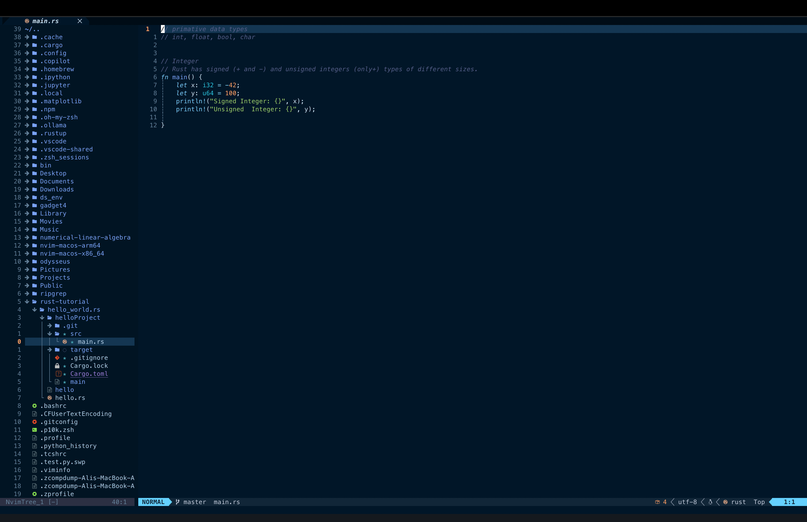

# vim-settings
Neovim Configuration

My personal Neovim configuration, written in Lua and managed with Lazy.nvim.

This configuration is focused on providing a modern development environment with LSP support, autocompletion, Treesitter, Git integration, file navigation, fuzzy finding, formatting, linting, and a comfortable editing workflow.


###  Structure

```
├── init.lua
├── lazy-lock.json
├── lua/
│   └── josean/
│       ├── core/
│       ├── plugins/
│       └── lazy.lua
└── Outputs/
```

Main files
File	Purpose
init.lua	Entry point for the Neovim configuration
lua/josean/core/	Core Neovim settings and options
lua/josean/plugins/	Plugin configurations
lua/josean/plugins/lsp/	LSP-related configuration
lua/josean/lazy.lua	Lazy.nvim bootstrap and plugin loading
lazy-lock.json	Locked plugin versions

### Features


The current lockfile includes plugins such as telescope.nvim, nvim-treesitter, nvim-lspconfig, nvim-cmp, mason.nvim, conform.nvim, nvim-lint, gitsigns.nvim, nvim-tree.lua, tokyonight.nvim, trouble.nvim, and others. {"fallbackMarkdown":"(GitHub)","reference":{"matched_text":"","prefix":null,"start_idx":2151,"end_idx":2168,"safe_urls":["https://raw.githubusercontent.com/AliPhilip05/vim-settings/main/lazy-lock.json"],"refs":[],"alt":"(GitHub)","prompt_text":null,"type":"grouped_webpages","fallback_items":null,"status":"done","style":null,"error":null,"items":[{"title":"","url":"https://raw.githubusercontent.com/AliPhilip05/vim-settings/main/lazy-lock.json","attribution":"GitHub","pub_date":null,"snippet":null,"attribution_segments":null,"supporting_websites":[],"refs":[{"turn_index":2,"ref_type":"view","ref_index":2}],"hue":null,"attributions":null}]},"showLoginRequiredCard":false}

### Installation
Requirements

Make sure the following are installed:

Neovim

Git

A working C compiler/toolchain for native plugins

ripgrep for Telescope search

Node.js if required by the language servers you use

tmux if using the tmux navigation integration

Clone the configuration

Back up your existing Neovim configuration first, then clone this repository:

git clone https://github.com/AliPhilip05/vim-settings.git ~/.config/nvim


### Start Neovim:

nvim


Lazy.nvim will bootstrap itself and install the configured plugins. The configuration explicitly bootstraps Lazy.nvim if it is not already installed. {"fallbackMarkdown":"(GitHub)","reference":{"matched_text":"","prefix":null,"start_idx":2967,"end_idx":2984,"safe_urls":["https://raw.githubusercontent.com/AliPhilip05/vim-settings/main/lua/josean/lazy.lua"],"refs":[],"alt":"(GitHub)","prompt_text":null,"type":"grouped_webpages","fallback_items":null,"status":"done","style":null,"error":null,"items":[{"title":"","url":"https://raw.githubusercontent.com/AliPhilip05/vim-settings/main/lua/josean/lazy.lua","attribution":"GitHub","pub_date":null,"snippet":null,"attribution_segments":null,"supporting_websites":[],"refs":[{"turn_index":2,"ref_type":"view","ref_index":1}],"hue":null,"attributions":null}]},"showLoginRequiredCard":false}

### How It Works

The main init.lua is intentionally small:

require("josean.core")
require("josean.lazy")


The core configuration is loaded first, followed by the plugin manager. {"fallbackMarkdown":"(GitHub)","reference":{"matched_text":"","prefix":null,"start_idx":3181,"end_idx":3198,"safe_urls":["https://github.com/AliPhilip05/vim-settings/blob/main/init.lua"],"refs":[],"alt":"(GitHub)","prompt_text":null,"type":"grouped_webpages","fallback_items":null,"status":"done","style":null,"error":null,"items":[{"title":"vim-settings/init.lua at main · AliPhilip05/vim-settings · GitHub","url":"https://github.com/AliPhilip05/vim-settings/blob/main/init.lua","attribution":"GitHub","pub_date":null,"snippet":null,"thumbnail_url":"https://images.openai.com/static-rsc-1/w5XoNuqZgCf5aEvSt9sdNssv6u6LuboJ21n9roexAnUBoJXKGwWiLB04G9FE3_F1mCdr910FnbTI2jmzEH7PxZkbplkPIZnaD0cGxNQcO_YE8WonHnrIaObyP33w3WShfPmb42jCyQFT13tZy3X82wA4CQJA3nmOa9HWSnJEovuX-c9WYiNpIsbgXpefqns0","attribution_segments":null,"supporting_websites":[],"refs":[{"turn_index":1,"ref_type":"view","ref_index":0}],"hue":null,"attributions":null}]},"showLoginRequiredCard":false}

Lazy.nvim then imports plugins from:

josean.plugins
josean.plugins.lsp


Plugin update checking is enabled while notifications and change-detection notifications are disabled. {"fallbackMarkdown":"(GitHub)","reference":{"matched_text":"","prefix":null,"start_idx":3387,"end_idx":3404,"safe_urls":["https://raw.githubusercontent.com/AliPhilip05/vim-settings/main/lua/josean/lazy.lua"],"refs":[],"alt":"(GitHub)","prompt_text":null,"type":"grouped_webpages","fallback_items":null,"status":"done","style":null,"error":null,"items":[{"title":"","url":"https://raw.githubusercontent.com/AliPhilip05/vim-settings/main/lua/josean/lazy.lua","attribution":"GitHub","pub_date":null,"snippet":null,"attribution_segments":null,"supporting_websites":[],"refs":[{"turn_index":2,"ref_type":"view","ref_index":1}],"hue":null,"attributions":null}]},"showLoginRequiredCard":false}

### Plugins

Some of the main plugins currently included are:

lazy.nvim — Plugin manager

telescope.nvim — Fuzzy finder

nvim-tree.lua — File explorer

nvim-treesitter — Syntax parsing

nvim-lspconfig — LSP configuration

mason.nvim — LSP/tool installer

nvim-cmp — Completion engine

LuaSnip — Snippet engine

gitsigns.nvim — Git decorations and actions

conform.nvim — Code formatting

nvim-lint — Asynchronous linting

trouble.nvim — Diagnostics and references

which-key.nvim — Keybinding helper

tokyonight.nvim — Colorscheme

lualine.nvim — Statusline

bufferline.nvim — Buffer tabs

nvim-autopairs — Automatic brackets/quotes

nvim-surround — Surround text objects

lazygit.nvim — Lazygit integration

vim-tmux-navigator — Tmux/Neovim navigation

The exact plugin revisions are pinned in lazy-lock.json for reproducible setups. 


Inside Neovim, Lazy.nvim can be opened with:

:Lazy


### LSP configuration lives under:

lua/josean/plugins/lsp/


This keeps language-server configuration separate from the rest of the plugin configuration and makes it easier to add or modify language support.

This is a personal Neovim configuration, so some settings and keybindings are tailored to my own workflow. Feel free to use it as a starting point for your own configuration and modify anything you need.

### License

Use, modify, and adapt this configuration as you see fit.


# output


